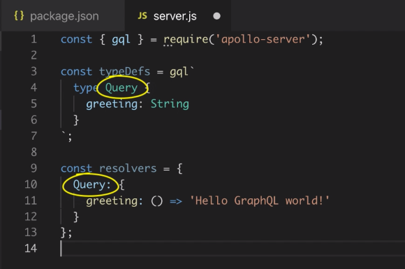
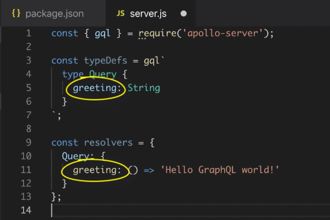
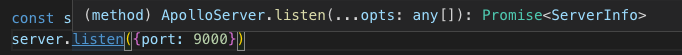

# Getting Started
```javascript
const { gql } = require('apollo-server');

// define the GraphQL schema
const typeDefs = gql`
  type Query {
    greeting: String
  }
`;

const resolvers = {
  Query: {
    greeting: () => 'Hello GraphQL World!'
  }
};
```

Within the `resolvers` object is `Query`; which is a nested object b/c it represents a **type**.

The `greeting()` function will be called by the GraphQL engine every time a client sends a "greeting" query; meaning this function will be called to **resolve** the value of the greeting field.

The `resolvers` object needs to **mirror** the  **type definitions** (`typeDefs`) precisely (otherwise things won't work correctly).



**type definitions** are the **interface** for our API
**resolvers** are the **implementation**

Now we're ready to create the server by importing `ApolloServer`.  Its constructor takes config options in an object:  (in )`typeDefs` and `resolvers`).
Can use ES6 shorthand since keys match values (we named after the keys)

```javascript
const server = new ApolloServer({typeDefs,resolvers});
```
instead of:
```javascript
const server = new ApolloServer({
  typeDefs: typeDefs,
  resolvers: resolvers
});
```


The `listen()` method returns a `Promise`, so we can chain `.then()`

run `node server.js`